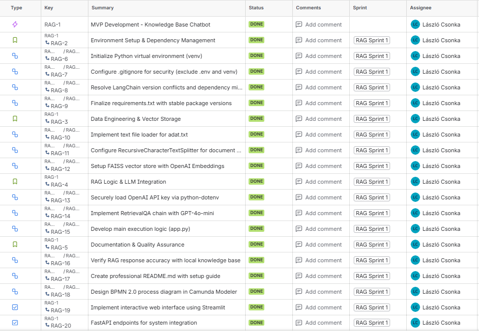
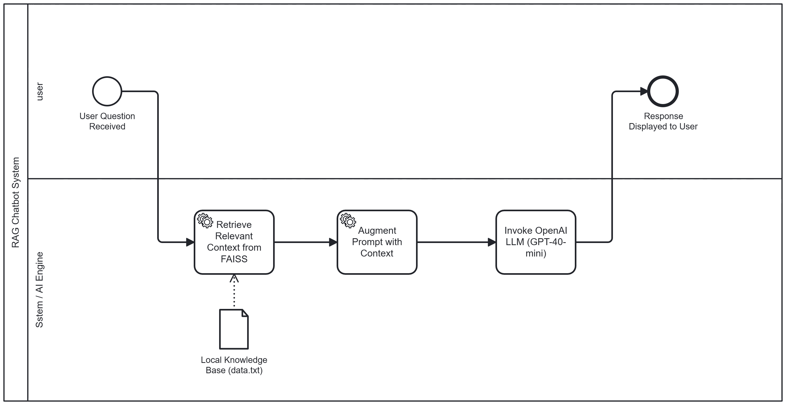

# Enterprise RAG Knowledge System (LangChain + OpenAI)

A professional-grade Retrieval-Augmented Generation (RAG) application that demonstrates how to transform static documents into interactive knowledge bases. This project features both a **User Interface (Streamlit)** and a **REST API (FastAPI)**, mimicking real-world AI deployments.

---
## 🌐 Live Access
**The application is deployed and ready to test!**
* **Interactive Web UI:** [Access the Chatbot here](IDE_ILLESZD_BE_A_STREAMLIT_LINKEKET)
* **Note:** The demo uses a pre-configured knowledge base focused on the system's own architecture.

---
## 🏗️ Project Management & Methodology
This project was developed using professional software engineering standards, focusing on transparency and process modeling.

### 📋 Agile Development (Scrum)
The development followed the **Scrum framework**, managed in **Jira**. All tasks were organized under a main **MVP Development Epic** to ensure structured delivery.

* **Planning:** 1-week sprint with a defined Backlog and Story Point estimation.
* **Tracking:** Tasks were organized into an Epic, User Stories, and Tasks to ensure clear feature delivery.
* **Execution:** Successfully delivered the RAG engine, Streamlit Web UI, and FastAPI endpoints within a single sprint (Sprint 1).

### ⚙️ Business Process Modeling (BPMN 2.0)
The system's internal logic was modeled in **Camunda** to visualize the interaction between the user, the vector store, and the LLM.
* **Figure 1:** RAG Workflow - Clear separation between User Interaction and Backend Retrieval Logic.

---

## 🚀 Key Features
* **Dual-Interface Access:** User-friendly Web UI and developer-ready REST API.
* **Intelligent Retrieval:** Powered by **FAISS** (Facebook AI Similarity Search) for high-performance context fetching.
* **Advanced RAG Chain:** Seamless integration using **LangChain** for context-aware answering.
* **Optimized LLM:** Uses **GPT-4o-mini** for an ideal balance of speed, cost, and intelligence.

---

## 🛠️ Tech Stack
* **Language:** Python 3.12+
* **AI Orchestration:** LangChain
* **Web UI:** Streamlit (Rapid Prototyping)
* **API Framework:** FastAPI (Production-ready endpoints)
* **Vector Store:** FAISS
* **LLM:** OpenAI GPT-4o-mini
* **Task & Process:** Jira (Scrum), Camunda (BPMN 2.0)

---

## 📋 Installation and Setup

### 1. Clone & Environment
Bash

git clone <your-repository-link>
cd rag-demo
python -m venv venv
# Windows:
.\venv\Scripts\activate
# Linux/MacOS:
source venv/bin/activate

### 2. Install Dependencies

Bash

pip install -r requirements.txt

### 3. API Key Configuration

Create a .env file in the root directory:

Plaintext

OPENAI_API_KEY=your_actual_key_here

#### ⚡ Running the Application
This project provides two primary ways to interact with the AI:

#### A. Web Interface (Streamlit)
Ideal for end-users to chat with the document.

Bash

streamlit run app.py

#### B. REST API (FastAPI)
Ideal for integrating the chatbot into other systems or mobile apps.

Bash

uvicorn api:app --reload

- Once running, access the interactive API documentation at: http://127.0.0.1:8000/docs

#### 📖 Data Preparation (data.txt)
The system reads from data.txt. For best results:

Use clear headings and bullet points.

Keep related information in the same paragraph.

Use double newlines to separate distinct topics.